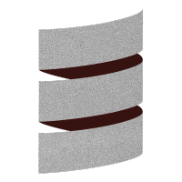

Scala Native is an optimizing ahead-of-time compiler and lightweight managed runtime designed specifically for Scala

Official documentation here  http://www.scala-native.org/en/v0.3.9-docs/

## Installation

* In Mac install **llvm** **bdw-gc** **re2**

    ```
     brew install llvm
     brew install bdw-gc re2
    ```

* Create new project using template **gitter8**

    ```
    sbt new scala-native/scala-native.g8
    ```
* Check the example of what you can do [here](src/main/scala/com/politrons/server/Features.scala)    

* To run the examples just use sbt command

    ```
    sbt run
    ```